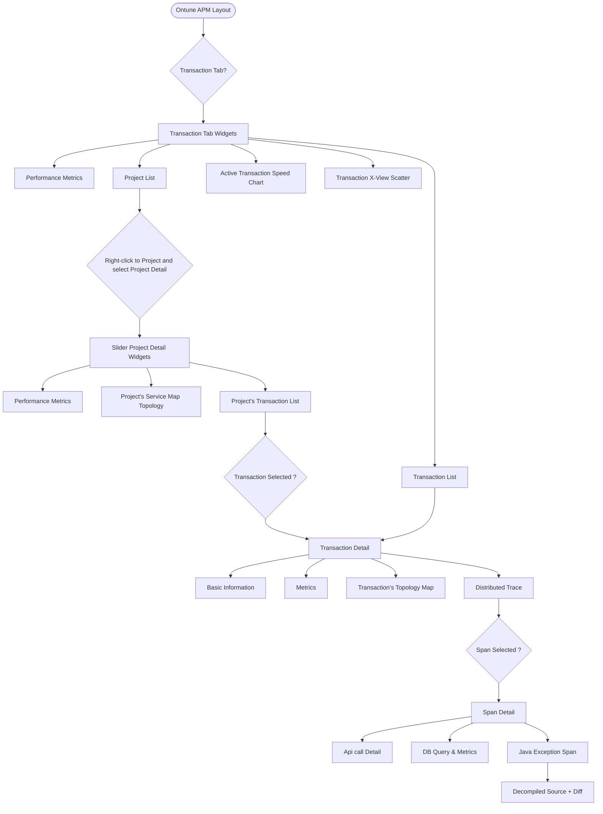
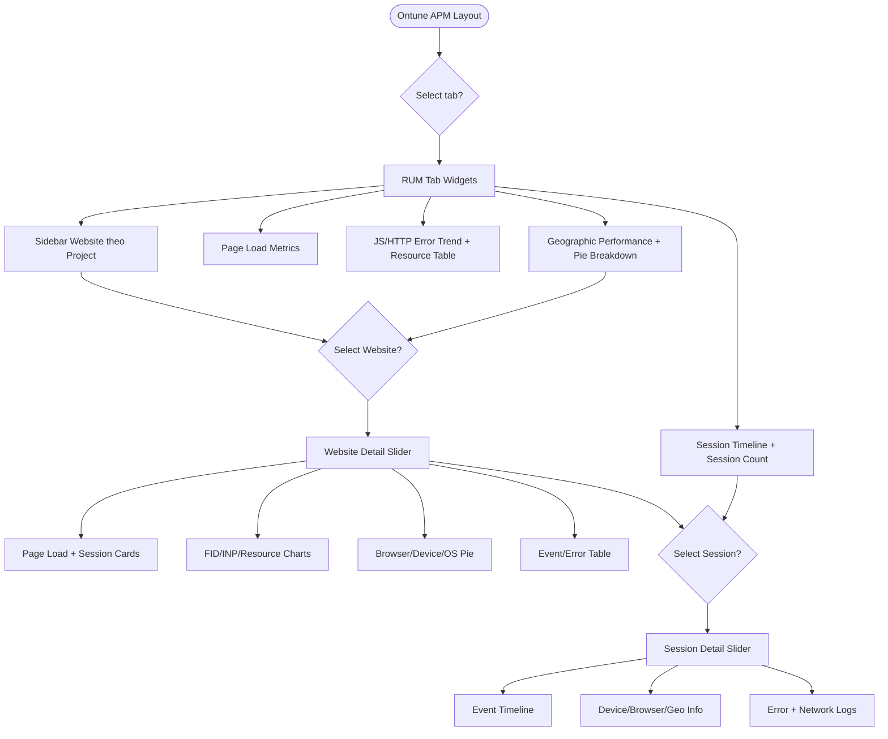
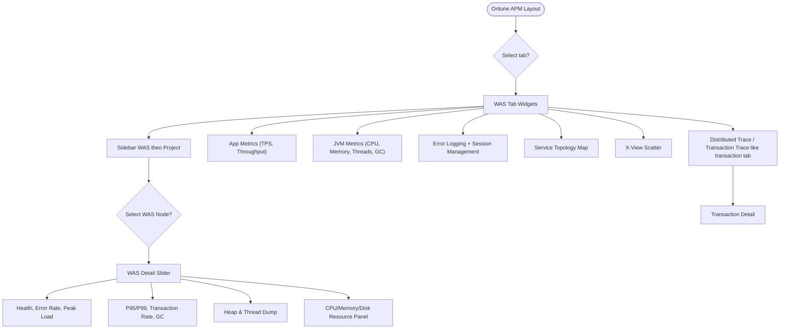
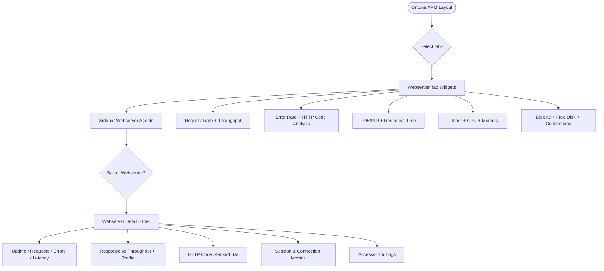

# UX Flow Diagram

## Transaction Tab

```mermaid
flowchart TB
    start([Ontune APM Layout]) --> tabs{Transaction Tab?}
    tabs --> t[Transaction Tab Widgets]

    t --> metrics[Performance Metrics]
    t --> projects[Project List]
    t --> speed[Active Transaction Speed Chart]
    t --> xview[Transaction X-View Scatter]
    t --> transList[Transaction List]
    transList --> txDetail

    projects --> projMenu{Right-click to Project and select Project Detail}
    projMenu --> projDetail[Slider Project Detail Widgets]
    projDetail --> projInfo[Performance Metrics]
    projDetail --> serviceMap[Project's Service Map Topology]
    projDetail --> projTrans[Project's Transaction List]

    projTrans --> pickTx{Transaction Selected ?}
    pickTx --> txDetail[Transaction Detail]

    txDetail --> txInfo[Basic Information]
    txDetail --> performance[Metrics]
    txDetail --> topology[Transaction's Topology Map]
    txDetail --> trace[Distributed Trace]

    trace --> spanSelect{Span Selected ?}
    spanSelect --> spanDetail[Span Detail]

    spanDetail --> apiCall[Api call Detail]
    spanDetail --> dbInfo[DB Query & Metrics]
    spanDetail --> exception[Java Exception Span]
    exception --> sourceInfo[Decompiled Source + Diff]
```

## RUM Tab

```mermaid
flowchart TB
    rumStart([Ontune APM Layout]) --> rumSelect{Select tab?}
    rumSelect --> rumTab[RUM Tab Widgets]

    rumTab --> rumSidebar[Sidebar Website theo Project]
    rumTab --> rumOverview[Page Load Metrics]
    rumTab --> rumErrors[JS/HTTP Error Trend + Resource Table]
    rumTab --> rumGeo[Geographic Performance + Pie Breakdown]
    rumTab --> rumSessions[Session Timeline + Session Count]

    rumSidebar --> websiteSelect{Select Website?}
    rumGeo --> websiteSelect
    websiteSelect --> websiteDetail[Website Detail Slider]
    websiteDetail --> websiteCards[Page Load + Session Cards]
    websiteDetail --> websiteCharts[FID/INP/Resource Charts]
    websiteDetail --> websiteBreakdown[Browser/Device/OS Pie]
    websiteDetail --> websiteEvents[Event/Error Table]

    websiteDetail --> sessionSelect{Select Session?}
    rumSessions --> sessionSelect
    sessionSelect --> sessionDetail[Session Detail Slider]
    sessionDetail --> sessionTimeline[Event Timeline]
    sessionDetail --> sessionContext[Device/Browser/Geo Info]
    sessionDetail --> sessionLogs[Error + Network Logs]
```

## WAS Tab

```mermaid
flowchart TB
    wasStart([Ontune APM Layout]) --> wasSelect{Select tab?}
    wasSelect --> wasTab[WAS Tab Widgets]

    wasTab --> wasSidebar[Sidebar WAS theo Project]
    wasTab --> wasDash["App Metrics (TPS, Throughput)"]
    wasTab --> wasJVM["JVM Metrics (CPU, Memory, Threads, GC)"]
    wasTab --> wasTables[Error Logging + Session Management]
    wasTab --> wasServiceMap[Service Topology Map]
    wasTab --> wasXview[X-View Scatter]
    wasTab --> wasTrace[Distributed Trace / Transaction Trace like transaction tab]

    wasSidebar --> wasNodeSelect{Select WAS Node?}
    wasNodeSelect --> wasDetail[WAS Detail Slider]
    wasDetail --> wasCards[Health, Error Rate, Peak Load]
    wasDetail --> wasCharts[P95/P99, Transaction Rate, GC]
    wasDetail --> wasDump[Heap & Thread Dump]
    wasDetail --> wasResource[CPU/Memory/Disk Resource Panel]

   
    wasTrace --> wasTxDetail["Transaction Detail"]
```

## Webserver Tab

```mermaid
flowchart TB
    webStart([Ontune APM Layout]) --> webSelect{Select tab?}
    webSelect --> webTab[Webserver Tab Widgets]

    webTab --> webSidebar[Sidebar Webserver Agents]
    webTab --> webDash[Request Rate + Throughput]
    webTab --> webErrors[Error Rate + HTTP Code Analysis]
    webTab --> webLatency[P95/P99 + Response Time]
    webTab --> webGauges[Uptime + CPU + Memory]
    webTab --> webSystem[Disk IO + Free Disk + Connections]

    webSidebar --> webNodeSelect{Select Webserver?}
    webNodeSelect --> webDetail[Webserver Detail Slider]
    webDetail --> webCards[Uptime / Requests / Errors / Latency]
    webDetail --> webCharts[Response vs Throughput + Traffic]
    webDetail --> webCodes[HTTP Code Stacked Bar]
    webDetail --> webConnections[Session & Connection Metrics]
    webDetail --> webLogs[Access/Error Logs]
```
